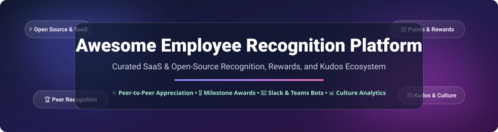
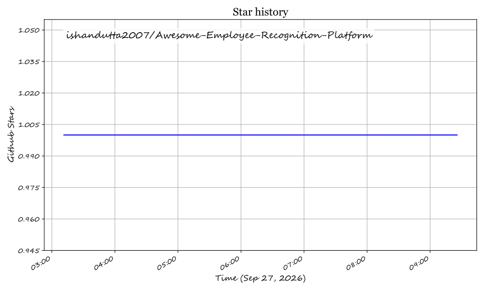

# Awesome Employee Recognition Platform 🌟

  

  
  
  
  

## 🚀 Top Employee Recognition Platforms & HR Tech Ecosystem

**Curated List of SaaS Products & Open-Source GitHub Projects for Employee Recognition, Peer Rewards, Kudos, Points Economies, Service Awards & Company Culture Programs**

*Last updated: September 2026* 📅

---

### 💡 Overview & SEO Summary
Welcome to the definitive awesome list of **Employee Recognition Software** and **HR Recognition Tools**. Whether you are looking for enterprise-grade SaaS rewards platforms or self-hosted open-source Slack/Teams kudos bots, this curated ecosystem covers peer-to-peer appreciation, automated milestone awards, core values tagging, custom reward catalogs, and workforce engagement analytics.

---

## 📌 Table of Contents
- [📊 Market Insights](#-market-insights)
- [🏢 SaaS & Hosted Platforms](#-saas--hosted-platforms)
- [💻 Open-Source GitHub Projects](#-open-source-github-projects)
- [🤝 How to Contribute](#-how-to-contribute)
- [💖 Support & Sponsorship](#-support--sponsorship)
- [📈 Star History](#-star-history)
- [⚠️ Disclaimer](#%EF%B8%8F-disclaimer)

---

## 📊 Market Insights

> **Global Market Size & Industry Structure:**  
> The global **Employee Recognition Software Market** is estimated at **~$21.4 Billion in 2026** (with specialized rewards/recognition SaaS segments at **~$1.13 Billion**), growing at a CAGR of ~9.4% to 10.2%. The sector is **moderately to highly fragmented**—there is no single "winner-take-all" dominant provider due to diverse organization sizes, regional compliance requirements, global reward fulfillment needs, and distinct enterprise vs. startup culture preferences.

---

## 🏢 SaaS & Hosted Platforms

The table below details commercial employee recognition solutions, sorted by **Company Size (Revenue / Valuation)** in descending order.

| Platform 🛠️ | Company Size (Est. Revenue / Valuation) 🏛️ | Starting Tier Pricing 💰 | Free Tier / Free Trial Limits 🎁 | Key Features & Highlights ⚡ |
| :--- | :--- | :--- | :--- | :--- |
| **[Workhuman](https://www.workhuman.com/)** | ~$1.2B Annual Revenue / $1.2B Valuation (~1,000+ employees) | ~$4.00 - $6.00 / user / month (Custom Enterprise Quote) | No Free Tier; No Self-Serve Free Trial (Demo on request) | Enterprise global recognition, service milestones, life events & social recognition feed. |
| **[Awardco](https://www.awardco.com/)** | ~$75.2M Annual Revenue / $1.0B Valuation (~670 employees) | $3,000 / year base package (or ~$3.75 / user / month) | No Free Tier; No Self-Serve Free Trial (Custom demo required) | Enterprise rewards with Amazon Business catalog integration & global fulfillment. |
| **[Achievers](https://www.achievers.com/)** | ~$50.0M Annual Revenue / Subsidiary of Blackhawk Network (~1,000+ employees) | ~$4.00 - $5.00 / user / month (Custom Enterprise Quote) | No Free Tier; No Self-Serve Free Trial (Sales demo on request) | High-frequency peer recognition, HCM integrations & global rewards exchange. |
| **[Bonusly](https://bonus.ly/)** | ~$13.4M Annual Revenue / ~$76M Valuation (~84 employees) | $3.00 / user / month (Core / Team Plan billed annually) | **Free Plan available for up to 8 users**; 30-day Free Trial for paid tiers | Peer-to-peer recognition with points economy, core values hashtags & automated gift cards. |
| **[Kudos](https://www.kudos.com/)** | ~$8.8M Annual Revenue (~100 employees) | ~$3.25 / user / month (Basic Tier custom contract) | No Free Tier; Free Trial available upon sales discretion | Values-based recognition, performance insights & custom employee awards. |
| **[Guusto](https://guusto.com/)** | ~$6.6M Annual Revenue (~75 employees) | $80.00 / month (Lite Plan including up to 16 seats, additional seats ~$4 - $5 / user / mo) | **Free Account available** (single-user / payout rewards only); 30-day Free Trial for paid tiers | Simple recognition & direct gift card rewards suited for frontline & non-desk workers. |
| **[Nectar HR](https://www.nectarhr.com/)** | ~$6.0M Annual Revenue (~200 employees) | $4.00 / user / month (Standard Plan) | No Free Tier; 14-day Free Trial available upon demo request | Peer recognition, swag management, pulse surveys & custom company rewards. |
| **[Assembly](https://www.joinassembly.com/)** | ~$3.9M Annual Revenue / Acquired by Quantum Workplace (~35 employees) | $2.80 / user / month (Celebrate Plan billed annually) | **Free Starter Plan available for up to 10 users**; 14-day Free Trial | Lightweight peer appreciation, Slack/Teams culture workflows & anniversary announcements. |
| **[Motif](https://www.motif.com/)** | Mid-Market Private (<$5.0M Est. Revenue) | $3.00 / user / month (Standard Plan) | No Free Tier; 14-day Free Trial | Modern employee engagement, meaningful appreciation & team culture building. |

---

## 💻 Open-Source GitHub Projects

The following open-source repos and tools provide self-hosted kudos, Slack/Teams bots, or HR workspace solutions. Sorted by **GitHub_Stars** in descending order.

| Project 📦 | GitHub_Stars ⭐️ | Description & Core Stack 🛠️ |
| :--- | :--- | :--- |
| **[Meeds](https://github.com/Meeds-io/meeds)** |  | Decentralized engagement and recognition platform using open tokens & kudos gamification. |
| **[Praise](https://github.com/givepraise/praise)** |  | Community intelligence and peer recognition system built for transparent praise & rewards. |
| **[Open Kudos Bot](https://github.com/Pagepro/open-kudos)** |  | Open-source Slack recognition bot allowing team members to give points & redeem rewards. |
| **[Peerly](https://github.com/joshsoftware/peerly)** |  | Open-source peer reward system based on weekly "hi5" tokens tied to company core values. |
| **[Slack Kudos Bot](https://github.com/MartinMcGirk/Slack-Kudos-Bot)** |  | Lightweight Node.js Slack bot for peer appreciation, thank-you shoutouts, and leaderboard tracking. |
| **[Bravo](https://github.com/Codepath-BravoInc/Bravo)** |  | Real-time recognition & micro-bonuses application featuring activity feeds and reward redemptions. |
| **[Employee Recognition Awards](https://github.com/kylesezhi/employee-recognition-awards)** |  | Web application to generate, email, and track employee achievement & recognition award certificates. |
| **[Pulse HR](https://github.com/davide97g/pulse-hr)** |  | Open-source people-first HR workspace with built-in kudos, growth signals, and self-hosting support. |

---

## 🤝 How to Contribute

Contributions are always welcome! 💖
1. **Fork** the repository 🍴
2. **Create** your feature branch (`git checkout -b feature/add-new-platform`) 🌿
3. **Add/Edit** entries in `README.md` following the tabular format 📝
4. **Submit** a Pull Request with a clear explanation 🚀

---

## 💖 Support & Sponsorship

If you find this repository helpful for your organization, culture team, or HR tech research, please consider supporting the project! 🌟

- **Star** this repository to show your appreciation! ⭐️
- **Fork & Share** with HR leaders, developers, and workspace administrators! 📢
- **Sponsor the Maintainer:** Buy me a coffee via the [GitHub Sponsor Dashboard](https://github.com/sponsors/ishandutta2007) ☕️

---

## 📈 Star History

---

## ⚠️ Disclaimer

- This list is **community-curated** for research purposes and does not constitute formal HR, tax, or legal advice.
- Commercial pricing and product tiers are subject to vendor changes. Please verify directly with vendors before procurement.

---

  <b>Made with ❤️ for people leaders, culture teams, and open-source HR advocates.</b>

## ⭐ Star History

<a href="https://star-history.com/#ishandutta2007/Awesome-Employee-Recognition-Platform&Timeline" align="center">
  <picture>
    <source media="(prefers-color-scheme: dark)" srcset="assets/ishandutta2007_Awesome-Employee-Recognition-Platform_growth.svg">
    
  </picture>
</a>
